# Unified Anchor Workflow

## Traversal & Execution Rules

1. **Routing & Attribution:** Use this workflow for any problem. When executing or citing reasoning, reference techniques directly with their source (e.g., "apply Red/Green TDD -- Kent Beck").
2. **Graph Priority:** The Mermaid graph defines the canonical structure, node keys, and edge transitions.
3. **Execution Modes:**
   - **Chain Phases:** Execute anchors in strict dependency sequence.
   - **Toolkit Phases:** Select only the appropriate anchors for the domain context and bypass the rest via the Skip Protocol.
4. **Self-Correction:** Loop-back edges route backward to the earliest phase capable of resolving contradictions, verification failures, or drift. If a gate fails identically without new information after a loop-back, transition directly to `C_ESCALATE`.

## Fast Path

For trivial tasks (clear requirements, low complexity, no runtime impact):
1. `C_ENTRY` → `C_SENSE`
2. Skip to `C_MAKE` (for implementation), `C_TELL` (for output), or `C_EXIT`.
3. Record skipped nodes via the Skip Protocol.

## Traversal Procedure

| Node | Function |
|---|---|
| `C_ENTRY` | Initial entry point; retrieve prior context from the Remember layer. |
| `C_SENSE` | Clarity gate. Evaluates if requirements and problem framing are clear. |
| `C_SHAPE` | Structural gate. Determines if architectural or detailed design is required. |
| `C_MAKE` | Implementation gate. Confirms design stability prior to code/asset generation. |
| `C_CHECK` | Verification gate. Mandatory verification and evaluation pass. |
| `C_WATCH` | Operational gate. Checks for live/runtime execution and monitoring requirements. |
| `C_TELL` | Communication gate. Formats output for human consumption. |
| `C_RECOVER` | Routing hub for failure, drift, or contradiction remediation. |
| `C_EXIT` | Delivery confirmation and context persist step. |
| `C_ESCALATE` | Halts execution to request human intervention on unresolvable ambiguities. |

## Workflow Graph

```mermaid
graph TD
  %% ===== CONTROL FLOW LAYER =====
  C_ENTRY(["ENTRY: New Problem Received"])
  C_SENSE{"GATE: Problem Understood?"}
  C_SHAPE{"GATE: New Structure Needed?"}
  C_MAKE{"GATE: Design Stable?"}
  C_CHECK{"GATE: Verification Pass?"}
  C_WATCH{"GATE: Live Component?"}
  C_TELL{"GATE: Human-Facing Output?"}
  C_RECOVER{"GATE: Contradiction or Drift?"}
  C_EXIT(["EXIT: Problem Solved"])
  C_ESCALATE{{"ESCALATE: Surface to Human"}}

  %% ===== PHASE 1: ORIENT (TOOLKIT) =====
  subgraph P_ORIENT["PHASE 1: Orient (TOOLKIT)"]
    A_Cynefin["Cynefin Framework<br/><i>-- Dave Snowden</i>"]
    A_Wardley["Wardley Mapping<br/><i>-- Simon Wardley</i>"]
    A_JTBD["Jobs To Be Done<br/><i>-- Clayton Christensen</i>"]
    A_Occam["Occam's Razor<br/><i>-- William of Ockham</i>"]
    A_FirstPrinciples["First Principles Thinking<br/><i>-- Aristotle / Musk</i>"]
    A_SystemsThinking["Systems Thinking<br/><i>-- Peter Senge</i>"]
    A_StakeholderMapping["Stakeholder Mapping<br/><i>-- R. Edward Freeman</i>"]
  end

  %% ===== PHASE 2: FRAME (HYBRID) =====
  subgraph P_FRAME["PHASE 2: Frame (HYBRID)"]
    A_FiveWhys["Five Whys<br/><i>-- Taiichi Ohno</i>"]
    A_Fermi["Fermi Estimation<br/><i>-- Enrico Fermi</i>"]
    A_Feynman["Feynman Technique<br/><i>-- Richard Feynman</i>"]
    A_CoT["Chain of Thought<br/><i>-- Wei et al. 2022</i>"]
    A_Laddering["Laddering<br/><i>-- Gutman</i>"]
    A_BalanceSheet["Decisional Balance Sheet<br/><i>-- Janis & Mann</i>"]
    A_Morphological["Morphological Box<br/><i>-- Fritz Zwicky</i>"]
    A_SWOT["SWOT<br/><i>-- Albert Humphrey</i>"]
    A_Pugh["Pugh Matrix<br/><i>-- Stuart Pugh</i>"]
    A_PreMortem["Pre-Mortem<br/><i>-- Gary Klein</i>"]
    A_MECE["MECE<br/><i>-- Barbara Minto</i>"]
    A_req42["req42<br/><i>-- Adam Szarek</i>"]
    A_EARS["EARS<br/><i>-- Alistair Mavin et al.</i>"]
    A_INVEST["INVEST<br/><i>-- Bill Wake</i>"]
    A_Cockburn["Cockburn Use Cases<br/><i>-- Alistair Cockburn</i>"]
    A_PRD["PRD<br/><i>-- Product Mgmt Convention</i>"]
    A_Devil["Devil's Advocate<br/><i>-- Catholic Canonization</i>"]
    A_Hats["Six Thinking Hats<br/><i>-- Edward de Bono</i>"]
    A_Goodhart["Goodhart's Law<br/><i>-- Charles Goodhart</i>"]
    A_PERT["PERT<br/><i>-- US Navy</i>"]
    A_ADR["ADR<br/><i>-- Michael Nygard</i>"]
  end

  %% ===== PHASE 3: ARCHITECT (CHAIN) =====
  subgraph P_ARCH["PHASE 3: Architect (CHAIN)"]
    A_Conway["Conway's Law<br/><i>-- Melvin Conway</i>"]
    A_TeamTopo["Team Topologies<br/><i>-- Skelton & Pais</i>"]
    A_GRASP["GRASP<br/><i>-- Craig Larman</i>"]
    A_SOLID["SOLID Principles<br/><i>-- Robert C. Martin</i>"]
    A_SRP["SOLID-SRP<br/><i>-- Robert C. Martin</i>"]
    A_DIP["SOLID-DIP<br/><i>-- Robert C. Martin</i>"]
    A_CleanArch["Clean Architecture<br/><i>-- Robert C. Martin</i>"]
    A_Hexagonal["Hexagonal Architecture<br/><i>-- Alistair Cockburn</i>"]
    A_arc42["arc42<br/><i>-- Starke & Hruschka</i>"]
    A_CAP["CAP Theorem<br/><i>-- Eric Brewer</i>"]
    A_PACELC["PACELC<br/><i>-- Daniel Abadi</i>"]
    A_Fallacies["Fallacies of Distributed Computing<br/><i>-- Deutsch et al.</i>"]
    A_EventDriven["Event-Driven Architecture<br/><i>-- Distributed Systems Convention</i>"]
    A_TwelveFactor["Twelve-Factor App<br/><i>-- Adam Wiggins</i>"]
    A_Strangler["Strangler Fig<br/><i>-- Martin Fowler</i>"]
    A_WalkingSkeleton["Walking Skeleton<br/><i>-- Alistair Cockburn</i>"]
    A_ThinSlice["Thin Vertical Slice<br/><i>-- Agile/XP Convention</i>"]
    A_DAG["DAG Orchestration<br/><i>-- Airflow/Dagster Convention</i>"]
    A_SchemaEvolution["Schema Evolution<br/><i>-- Martin Fowler / General</i>"]
    A_FeatureFlags["Feature Flags<br/><i>-- LaunchDarkly Convention</i>"]
    A_DesignTokens["Design System Tokens<br/><i>-- Brad Frost</i>"]
  end

  %% ===== PHASE 4: DESIGN (CHAIN) =====
  subgraph P_DESIGN["PHASE 4: Design (CHAIN)"]
    A_DbC["Design by Contract<br/><i>-- Bertrand Meyer</i>"]
    A_Facade["GoF-Facade<br/><i>-- Gamma et al.</i>"]
    A_Adapter["GoF-Adapter<br/><i>-- Gamma et al.</i>"]
    A_CoR["GoF-Chain of Responsibility<br/><i>-- Gamma et al.</i>"]
    A_Observer["GoF-Observer<br/><i>-- Gamma et al.</i>"]
    A_Strategy["GoF-Strategy<br/><i>-- Gamma et al.</i>"]
    A_DeepModules["Deep Modules<br/><i>-- John Ousterhout</i>"]
    A_SLAP["SLAP<br/><i>-- Object Mentor Convention</i>"]
    A_DRY["DRY<br/><i>-- Hunt & Thomas</i>"]
    A_KISS["KISS<br/><i>-- Kelly Johnson</i>"]
    A_YAGNI["YAGNI<br/><i>-- Kent Beck / Ron Jeffries</i>"]
    A_Postel["Postel's Law<br/><i>-- Jon Postel</i>"]
    A_CodeSmells["Code Smells<br/><i>-- Beck / Fowler</i>"]
    A_Idempotency["Idempotency Keys<br/><i>-- Stripe Convention</i>"]
    A_Saga["Saga Pattern<br/><i>-- Caito et al.</i>"]
    A_Backpressure["Backpressure<br/><i>-- Reactive Streams Convention</i>"]
    A_ReactiveSignals["Reactive Signals<br/><i>-- Angular/SolidJS Convention</i>"]
    A_BEM["BEM Methodology<br/><i>-- Yandex</i>"]
  end

  %% ===== PHASE 5: BUILD (HYBRID) =====
  subgraph P_BUILD["PHASE 5: Build (HYBRID)"]
    A_TheoryBuilding["Programming as Theory Building<br/><i>-- Peter Naur</i>"]
    A_EffGo["Effective Go<br/><i>-- The Go Team</i>"]
    A_EffJava["Effective Java<br/><i>-- Joshua Bloch</i>"]
    A_EffPython["Effective Python<br/><i>-- Python Community</i>"]
    A_ConvCommits["Conventional Commits<br/><i>-- Community Specification</i>"]
    A_GitHubFlow["GitHub Flow<br/><i>-- GitHub</i>"]
    A_Mikado["Mikado Method<br/><i>-- Ellnestam & Brolund</i>"]
    A_Kanban["Kanban<br/><i>-- Toyota / David J. Anderson</i>"]
    A_ReAct["ReAct<br/><i>-- Yao et al. 2022</i>"]
    A_Reflexion["Reflexion<br/><i>-- Shinn et al. 2023</i>"]
    A_PlanExecute["Plan-and-Execute<br/><i>-- LangChain Convention</i>"]
    A_SelfConsistency["Self-Consistency<br/><i>-- Wang et al. 2022</i>"]
    A_ToT["Tree of Thoughts<br/><i>-- Yao et al. 2023</i>"]
    A_CoV["Chain-of-Verification<br/><i>-- Chern et al. 2023</i>"]
    A_Toolformer["Toolformer<br/><i>-- Schick et al. 2023</i>"]
    A_PromptEng["Prompt Engineering<br/><i>-- General Convention</i>"]
    A_RAG["RAG<br/><i>-- Lewis et al. 2020</i>"]
    A_Chunking["Chunking Strategies<br/><i>-- RAG Convention</i>"]
    A_HybridSearch["Hybrid Search<br/><i>-- RAG Convention</i>"]
    A_Reranking["Re-ranking<br/><i>-- RAG Convention</i>"]
    A_ContextBudget["Context Budgeting<br/><i>-- Anthropic</i>"]
    A_CostRouting["Cost-Aware Model Routing<br/><i>-- Anthropic</i>"]
    A_ToolUse["Tool-Use Action Space Design<br/><i>-- Anthropic / OpenAI</i>"]
    A_SOTA["SOTA<br/><i>-- State-of-the-Art Convention</i>"]
  end

  %% ===== PHASE 6: PROVE (CHAIN) =====
  subgraph P_PROVE["PHASE 6: Prove (CHAIN)"]
    A_Fagan["Fagan Inspection<br/><i>-- Michael Fagan</i>"]
    A_TDD["Red/Green TDD<br/><i>-- Kent Beck</i>"]
    A_TDDChicago["TDD Chicago School<br/><i>-- Chicago/Detroit Tradition</i>"]
    A_TestDouble["Test Double<br/><i>-- Gerard Meszaros</i>"]
    A_Pyramid["Testing Pyramid<br/><i>-- Mike Cohn</i>"]
    A_PageObject["Page Object Model<br/><i>-- Selenium / Fowler</i>"]
    A_PropertyBased["Property-Based Testing<br/><i>-- Claessen & Hughes</i>"]
    A_Mutation["Mutation Testing<br/><i>-- Richard Lipton</i>"]
    A_OWASP["OWASP Top 10<br/><i>-- OWASP</i>"]
    A_STRIDE["STRIDE<br/><i>-- Kohnfelder & Garg</i>"]
    A_LINDDUN["LINDDUN<br/><i>-- KU Leuven</i>"]
    A_RedTeaming["Red-Teaming<br/><i>-- General Convention</i>"]
    A_ConstitutionalAI["Constitutional AI<br/><i>-- Anthropic</i>"]
    A_Guardrails["Guardrails<br/><i>-- NVIDIA / General</i>"]
    A_IEC61508["IEC 61508 SIL Levels<br/><i>-- IEC</i>"]
    A_Regulated["Regulated Environment<br/><i>-- Compliance Convention</i>"]
    A_Chaos["Chaos Engineering<br/><i>-- Netflix</i>"]
    A_GameDays["Game Days<br/><i>-- General Convention</i>"]
    A_LLMEvals["LLM-Evaluations<br/><i>-- LLM Evaluation Practice</i>"]
    A_Benchmark["Benchmark Comparison<br/><i>-- Comparative Evaluation Convention</i>"]
    A_AgenticAudit["Agentic Stack Audit<br/><i>-- Anthropic</i>"]
    A_ISO25010["ISO/IEC 25010<br/><i>-- ISO</i>"]
    A_DoD["Definition of Done<br/><i>-- Schwaber & Sutherland</i>"]
  end

  %% ===== PHASE 7: OPERATE (CHAIN) =====
  subgraph P_OPERATE["PHASE 7: Operate (CHAIN)"]
    A_OTel["OpenTelemetry<br/><i>-- CNCF</i>"]
    A_DistributedTracing["Distributed Tracing<br/><i>-- General Convention</i>"]
    A_StructuredLogging["Structured Logging<br/><i>-- General Convention</i>"]
    A_ControlChart["Control Chart<br/><i>-- Walter Shewhart</i>"]
    A_Nelson["Nelson Rules<br/><i>-- Lloyd S. Nelson</i>"]
    A_SPC["SPC<br/><i>-- Shewhart / Deming</i>"]
    A_CircuitBreaker["Circuit Breaker<br/><i>-- Michael Nygard</i>"]
    A_Bulkhead["Bulkhead<br/><i>-- Michael Nygard</i>"]
    A_RetryBackoff["Retry with Backoff<br/><i>-- General Convention</i>"]
    A_SRE["Site Reliability Engineering<br/><i>-- Ben Treynor et al.</i>"]
    A_IncidentResponse["Incident Response<br/><i>-- General Convention</i>"]
    A_Postmortem["Postmortem<br/><i>-- General Convention</i>"]
    A_Rollback["Rollback Strategies<br/><i>-- General Convention</i>"]
    A_FinOps["FinOps<br/><i>-- FinOps Foundation</i>"]
    A_DMAIC["DMAIC<br/><i>-- Six Sigma</i>"]
  end

  %% ===== PHASE 8: CONVEY (TOOLKIT) =====
  subgraph P_CONVEY["PHASE 8: Convey (TOOLKIT)"]
    A_PyramidPrinciple["Pyramid Principle<br/><i>-- Barbara Minto</i>"]
    A_BLUF["BLUF<br/><i>-- US Military Doctrine</i>"]
    A_InvertedPyramid["Inverted Pyramid Style<br/><i>-- Journalism Convention</i>"]
    A_PlainEnglish["Plain English<br/><i>-- Strunk & White</i>"]
    A_4MAT["4MAT<br/><i>-- Bernice McCarthy</i>"]
    A_AIDA["AIDA Model<br/><i>-- E. St. Elmo Lewis</i>"]
    A_SenderReceiver["Sender-Receiver Discrepancy<br/><i>-- Shannon & Weaver</i>"]
    A_Hemingway["Hemingway Bridge<br/><i>-- Ernest Hemingway</i>"]
    A_Diataxis["Diataxis Framework<br/><i>-- Daniele Procida</i>"]
    A_DocsAsCode["Docs-as-Code<br/><i>-- Ralf D. Müller</i>"]
    A_ProgressiveDisclosure["Progressive Disclosure<br/><i>-- Jakob Nielsen</i>"]
    A_Bloom["Bloom's Taxonomy<br/><i>-- Benjamin Bloom</i>"]
    A_Archetypes["Mark & Pearson Archetypes<br/><i>-- Mark & Pearson</i>"]
  end

  %% ===== CROSS-CUTTING: REMEMBER =====
  subgraph P_REMEMBER["CROSS-CUTTING: Remember"]
    A_GTD["GTD<br/><i>-- David Allen</i>"]
    A_PARA["P.A.R.A. Method<br/><i>-- Tiago Forte</i>"]
    A_Dreyfus["Dreyfus Model<br/><i>-- Stuart & Hubert Dreyfus</i>"]
    A_SSOT["SSOT<br/><i>-- Data Management Convention</i>"]
    A_PEAA["PEAA<br/><i>-- Martin Fowler</i>"]
    A_Zettelkasten["Zettelkasten<br/><i>-- Niklas Luhmann</i>"]
  end

  %% ===== INTRA-PHASE CHAIN EDGES =====
  A_Conway --> A_TeamTopo --> A_GRASP --> A_SOLID --> A_SRP --> A_DIP --> A_CleanArch --> A_Hexagonal --> A_arc42 --> A_CAP --> A_PACELC --> A_Fallacies --> A_EventDriven --> A_TwelveFactor --> A_Strangler --> A_WalkingSkeleton --> A_ThinSlice --> A_DAG --> A_SchemaEvolution --> A_FeatureFlags --> A_DesignTokens

  A_DbC --> A_Facade --> A_Adapter --> A_CoR --> A_Observer --> A_Strategy --> A_DeepModules --> A_SLAP --> A_DRY --> A_KISS --> A_YAGNI --> A_Postel --> A_CodeSmells --> A_Idempotency --> A_Saga --> A_Backpressure --> A_ReactiveSignals --> A_BEM

  A_TheoryBuilding --> A_EffGo --> A_EffJava --> A_EffPython --> A_ConvCommits --> A_GitHubFlow --> A_Mikado --> A_Kanban

  A_MECE --> A_req42 --> A_EARS --> A_INVEST --> A_Cockburn --> A_PRD
  A_Devil --> A_Hats --> A_Goodhart --> A_PERT --> A_ADR

  A_Fagan --> A_TDD --> A_TDDChicago --> A_TestDouble --> A_Pyramid --> A_PageObject --> A_PropertyBased --> A_Mutation --> A_OWASP --> A_STRIDE --> A_LINDDUN --> A_RedTeaming --> A_ConstitutionalAI --> A_Guardrails --> A_IEC61508 --> A_Regulated --> A_Chaos --> A_GameDays --> A_LLMEvals --> A_Benchmark --> A_AgenticAudit --> A_ISO25010 --> A_DoD

  A_OTel --> A_DistributedTracing --> A_StructuredLogging --> A_ControlChart --> A_Nelson --> A_SPC --> A_CircuitBreaker --> A_Bulkhead --> A_RetryBackoff --> A_SRE --> A_IncidentResponse --> A_Postmortem --> A_Rollback --> A_FinOps --> A_DMAIC

  A_GTD --> A_PARA --> A_Dreyfus --> A_SSOT --> A_PEAA --> A_Zettelkasten

  %% ===== CONTROL-FLOW EDGES =====
  C_ENTRY -->|check memory| A_GTD
  A_Zettelkasten -->|context retrieved| C_SENSE
  C_ENTRY -->|fast path| C_SENSE

  C_SENSE -->|unclear -> Orient| A_Cynefin
  C_SENSE -->|unclear -> Frame| A_FiveWhys
  C_SENSE -->|clear| C_SHAPE

  C_SHAPE -->|new structure| A_Conway
  C_SHAPE -->|extend existing| A_DbC
  A_DesignTokens --> A_DbC
  A_BEM --> C_MAKE

  C_MAKE -->|not stable -> LOOP BACK| A_DbC
  C_MAKE -->|stable| A_TheoryBuilding
  A_SOTA --> C_CHECK

  C_CHECK -->|run checks| A_Fagan
  A_DoD --> C_WATCH

  C_WATCH -->|has runtime| A_OTel
  A_DMAIC -->|drift detected -> LOOP BACK| C_CHECK
  C_WATCH -->|no runtime| C_TELL

  C_TELL -->|human-facing| A_PyramidPrinciple
  A_Archetypes --> C_EXIT

  C_RECOVER -->|build defect -> LOOP BACK| A_TheoryBuilding
  C_RECOVER -->|design flaw -> LOOP BACK| A_DbC
  C_RECOVER -->|structural flaw -> LOOP BACK| A_Conway
  C_RECOVER -->|requirement wrong -> LOOP BACK| A_MECE
  C_RECOVER -->|fundamental misunderstanding -> LOOP BACK| A_FiveWhys
  C_RECOVER -->|verification gap -> LOOP BACK| A_Fagan
  C_RECOVER -->|operational issue -> LOOP BACK| A_OTel
  C_RECOVER -->|no contradiction| C_WATCH

  A_DMAIC -->|within bounds| C_TELL
  C_SENSE -->|trivial -> fast path| C_MAKE
  C_SENSE -->|trivial -> fast path| C_TELL

  C_EXIT -->|record context| A_GTD
  A_Zettelkasten -->|context recorded| C_ENTRY

  C_RECOVER -->|repeated failure| C_ESCALATE
  C_ESCALATE -->|human input resolves| C_ENTRY

```

